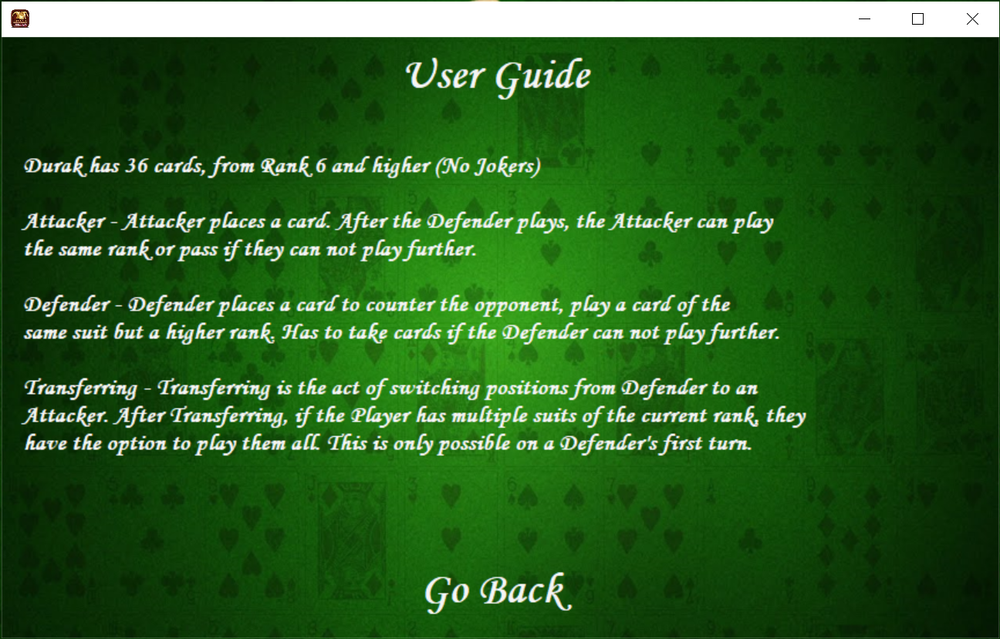
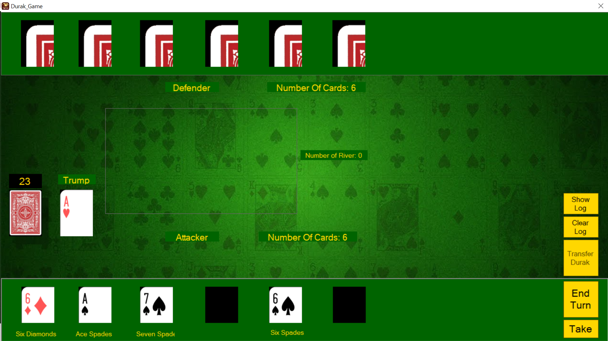

# DurakCardGame
This is a final assignment for OOP III. The following project satisfies the conditions stated in the requirements:

- Game-Play Logic (Two-Player). Although typically Durak is played with between two and six people, for
the purposes of this project you should limit the game to two-player, i.e. one human controlled player
and one computer controlled player. You are not required to implement more than two players for this
project.
 

- Basic Computer Player A.I. You are required to implement an A.I. logic structure that determines what
action the computer-controlled player will make, taking into consideration whether the computer is
attacking or defending, which suit is trump, and which cards (if any) in the computer’s hand can be
played.

- GUI. You are required to implement a graphical user interface (GUI) for your project. You are not
required to design an especially artistic interface, but it should be simple, clean, and functional. You are
required to make use of at least one custom control in your GUI. Note that if you are using graphical
elements that you did not create from scratch yourself (e.g. playing card images), you MUST source
these elements ethically and legally. This includes full and proper attribution to the artist in your project
documentation. 
 

 

- Object-Oriented Concepts. A major component of how you will be assessed is in the degree to which
you are utilizing the object-oriented concepts and techniques presented in the course 
should demonstrate encapsulation, abstraction, polymorphism and inheritance with a goal of ease of
maintenance and reusability. Durak is a card game with elements that are common with many other
card games (e.g. cards, decks, hands, etc). Any class you create that could be useful in other projects
should be coded in one or more class libraries. You are required to include at least one class library.
 

 

- Internal Documentation. At a minimum, your source code should be extensively documented with
opening comments and in-line commenting. Like graphical elements you did not create from scratch,
any code elements that you did not totally write yourself MUST be sourced ethically and legally. This
includes full and proper attribution of the original code author in the comments.

- User Guide. You must include some form of user guide or tutorial the player can refer to that explains
the functionality of the project. This may be text-based or video-based.

 

 

Main Menu:

 

 

User Guide:

 

 

Game Board:

 

 

